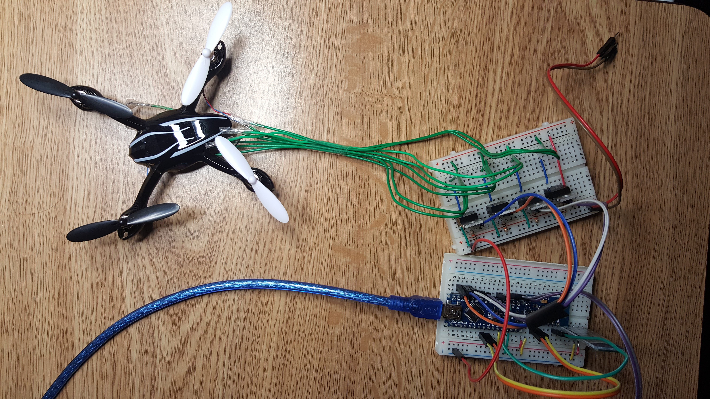
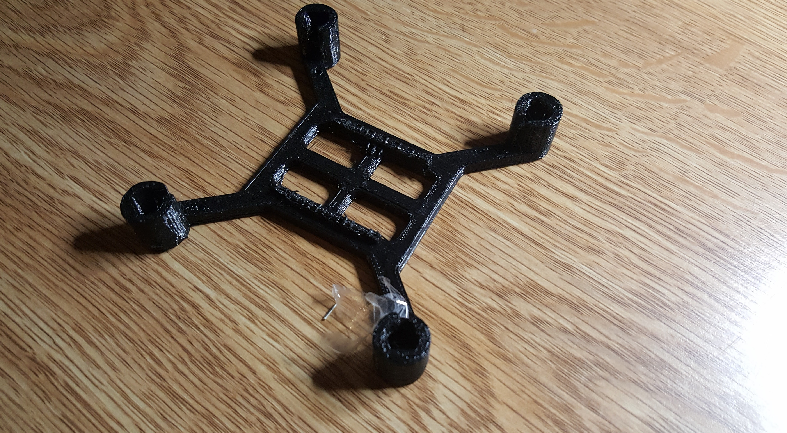
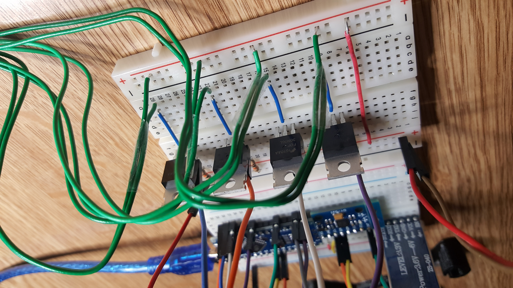

## Drone

This is a project to build an automated drone from scratch using an Arduino Nano as off the shelf motors and sensors (MPU6050 Gyroscope, Bluetooth module, etc).

We are currently in the stage of prototyping the hardware behind the drone.

Proposed 3D printed Drone frame:

Closeup of the circuit board:

