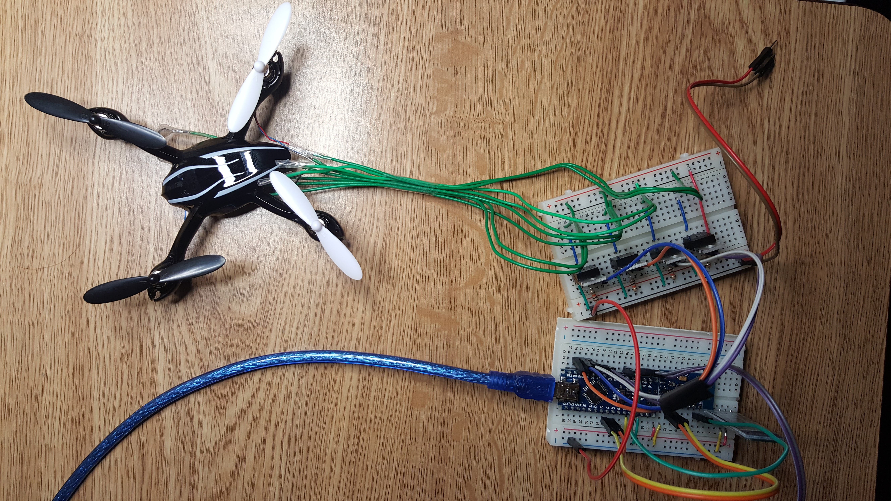
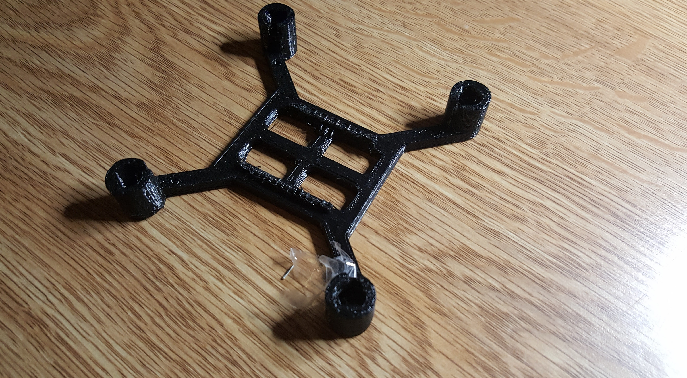
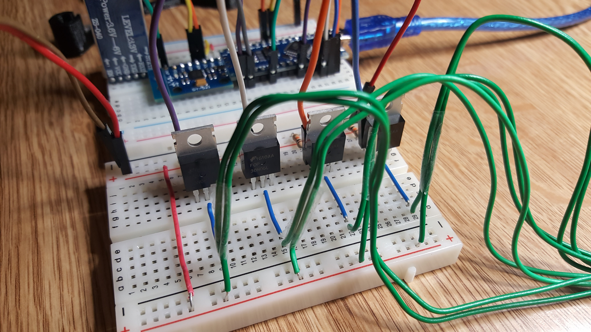
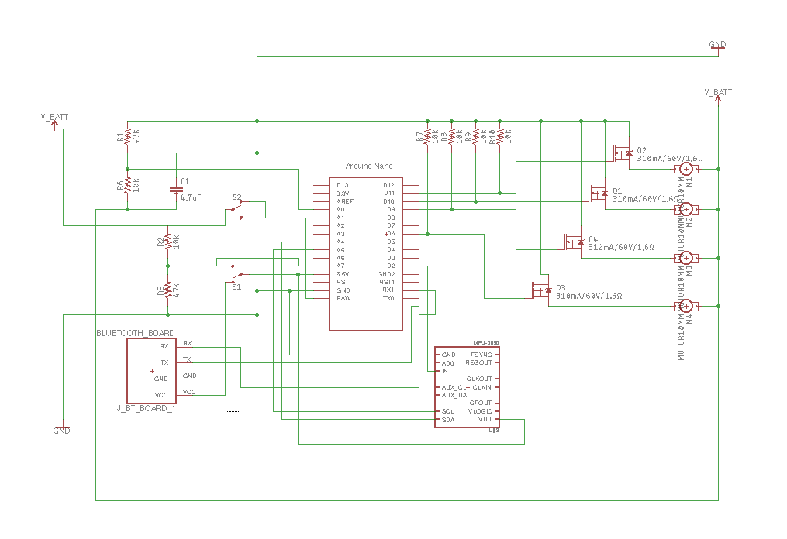
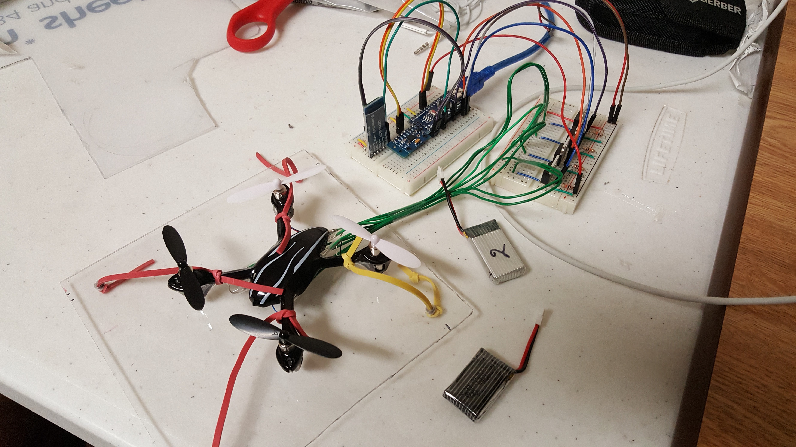

## Drone

This is a project to build an automated drone from scratch using and Arduino Nano as well as off-the-shelf motors and sensors (such as the MPU6050 Gyroscope).

We are currently in the stage of prototyping the hardware behind the drone.

Proposed 3D printed Drone frame:

Closeup of the circuit board:

Circuit schematic:

Testing rig:

